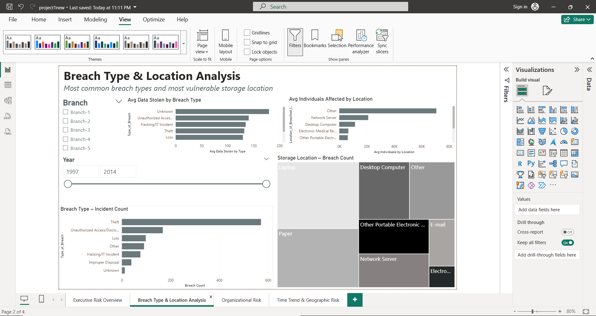
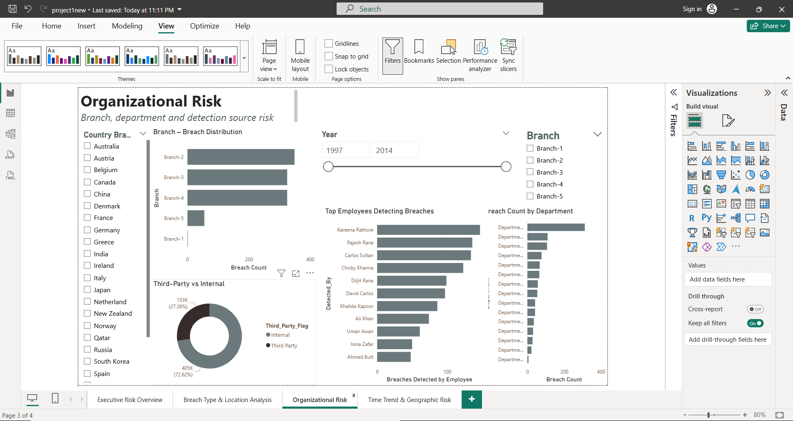
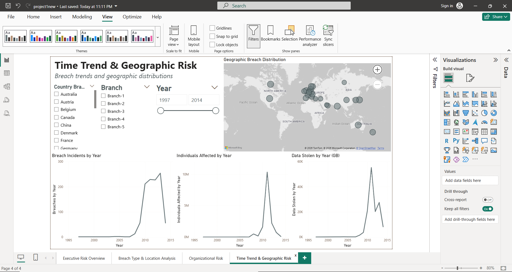

# 🔐 Healthcare Data Breach Analysis Dashboard

> **An interactive Power BI dashboard analyzing 1,055 real-world healthcare security breaches across 25 countries (1997–2014), affecting over 15.6 million individuals and 138,000 GB of stolen data.**

---

## 📌 Project Overview

Healthcare organizations are among the most targeted sectors for data breaches. This project analyzes a comprehensive breach dataset to uncover patterns in **how breaches happen, where they originate, who detects them, and how their impact has evolved over time**.

The goal is to turn raw breach records into **actionable security intelligence** — the kind that informs physical security policy, third-party risk management, and SOC prioritization.

---

## 📊 Dashboard Pages

### 1. Executive Risk Overview
High-level KPIs for leadership and risk teams.

| KPI | Value |
|-----|-------|
| Total Breaches | 1,000+ |
| Total Individuals Affected | ~16 Million |
| Total Data Stolen | 138,000 GB |
| Avg Breach Duration | 4,529 days |
| Third-Party Breach Share | 27.38% |

Includes breach impact breakdown by type and internal vs. third-party split.

---

### 2. Breach Type & Location Analysis
Identifies the most dangerous breach vectors and the most vulnerable storage locations.

**Key findings:**
- **Theft** is the #1 breach type by incident count (571 cases)
- **Laptops** and **Paper** are the most compromised storage locations — highlighting physical security as a critical gap
- **Unauthorized Access/Disclosure** causes the highest average data stolen per incident
- Interactive year slider (1997–2014) and branch filter for drill-down analysis

---

### 3. Organizational Risk
Maps breach risk across branches, departments, and detection sources.

**Key findings:**
- Branches 2–4 account for the majority of incidents
- **72.62% of breaches were internal** — insider threat and negligence are the dominant risk
- Top detection employees identified, enabling accountability analysis
- Department-level breach distribution for targeted remediation

---

### 4. Time Trend & Geographic Risk
Tracks how breaches evolved over time and where they are concentrated globally.

**Key findings:**
- Breach incidents peaked sharply around **2009–2011**
- The same period saw the highest spike in individuals affected and data volume stolen
- Geographic map covers breach distribution across **25 countries** spanning North America, Europe, Asia, and Australia
- Three synchronized line charts: incidents, individuals affected, and GB stolen — all by year

---

## 🛠️ Tools & Technologies

| Tool | Purpose |
|------|---------|
| **Power BI Desktop** | Dashboard design, DAX measures, interactive visuals |
| **Microsoft Excel** | Data cleaning, transformation, feature engineering |
| **Python** *(preprocessing)* | Data validation and transformation pipeline |

---

## 📁 Dataset

**File:** `Final_Transformed_Data.xlsx`  
**Records:** 1,055 breach incidents  
**Time range:** 1997 – 2014  
**Features (17 columns):**

| Column | Description |
|--------|-------------|
| `Name_of_Covered_Entity` | Organization affected |
| `Type_of_Breach` | Theft, Hacking, Unauthorized Access, etc. |
| `Location_of_Breached_Information` | Laptop, Paper, Network Server, etc. |
| `Individuals_Affected` | Number of people impacted |
| `Stolen_Data_GB` | Volume of stolen data |
| `breach_start` / `breach_end` | Breach timeline |
| `Duration` | Calculated breach duration in days |
| `Third_Party_Flag` | Internal vs. third-party breach |
| `Branch` / `Department` | Organizational unit |
| `CountryBranch` | Country of the affected branch |
| `Detected_By` | Employee who identified the breach |
| `Year` | Extracted year for time-series analysis |

---

## 🔍 Key Insights

1. **Physical security is the weakest link** — Laptops and paper documents are the top breach locations, meaning technical controls alone are insufficient.
2. **Insider threat dominates** — 72.62% of breaches were internal, pointing to a need for user behavior monitoring and access control policies.
3. **Breach durations are alarmingly long** — an average of 4,529 days (~12 years) suggests severe gaps in breach detection capability.
4. **Third-party risk is significant** — 27.38% of breaches involve external parties, reinforcing the need for vendor security assessments.
5. **2009–2011 was the peak risk window** — likely driven by increasing digitization without proportional security investment.

---

## 🛡️ Threat Analysis & Security Implications

This analysis highlights several systemic security weaknesses within healthcare organizations.

### 1. Physical Security Vulnerabilities

A significant portion of breaches originate from **laptops and paper records**, indicating that physical security controls remain a critical gap.

**Implication:**
Healthcare organizations must strengthen device encryption, asset tracking, and physical access control policies.

---

### 2. Insider Threat Dominance

Over **72% of breaches originate internally**, either through negligence or misuse of access privileges.

**Implication:**
Organizations should implement:

* User Behavior Analytics (UBA)
* Role-based access control
* Continuous monitoring of privileged accounts

---

### 3. Long Breach Detection Times

The average breach duration of **4,529 days (~12 years)** suggests a severe lack of detection mechanisms.

**Implication:**
Security teams should prioritize:

* SIEM deployment
* anomaly detection systems
* continuous log monitoring

---

### 4. Third-Party Risk Exposure

Approximately **27% of breaches involve third-party vendors**, highlighting supply chain security risks.

**Implication:**
Healthcare providers must enforce:

* vendor security assessments
* contractual security requirements
* continuous third-party risk monitoring

## 🚀 How to Use

1. Clone or download this repository
2. Open `dashboard/project1new.pbix` in **Power BI Desktop** (free download from Microsoft)
3. If prompted, reconnect the data source to `data/Final_Transformed_Data.xlsx`
4. Use the slicers (Year, Branch, Country) to explore interactive views

---

## 👤 Author

**Zeyad Elsayed**  
Computer Science Engineering — E-JUST  
📧 zeyad.mohamed.elsayedd@gmail.com  
🔗 [LinkedIn](https://bit.ly/3CZgEMk)

---

## 📄 License

This project is open for educational and portfolio purposes. Dataset used for analytical and learning purposes only.

**Key findings:**
- Branches 2–4 account for the majority of incidents
- **72.62% of breaches were internal** — insider threat and negligence are the dominant risk
- Top detection employees identified, enabling accountability analysis
- Department-level breach distribution for targeted remediation

---

### 4. Time Trend & Geographic Risk
Tracks how breaches evolved over time and where they are concentrated globally.

**Key findings:**
- Breach incidents peaked sharply around **2009–2011**
- The same period saw the highest spike in individuals affected and data volume stolen
- Geographic map covers breach distribution across **25 countries** spanning North America, Europe, Asia, and Australia
- Three synchronized line charts: incidents, individuals affected, and GB stolen — all by year

---

## 🛠️ Tools & Technologies

| Tool | Purpose |
|------|---------|
| **Power BI Desktop** | Dashboard design, DAX measures, interactive visuals |
| **Microsoft Excel** | Data cleaning, transformation, feature engineering |
| **Python** *(preprocessing)* | Data validation and transformation pipeline |

---

## 📁 Dataset

**File:** `Final_Transformed_Data.xlsx`  
**Records:** 1,055 breach incidents  
**Time range:** 1997 – 2014  
**Features (17 columns):**

| Column | Description |
|--------|-------------|
| `Name_of_Covered_Entity` | Organization affected |
| `Type_of_Breach` | Theft, Hacking, Unauthorized Access, etc. |
| `Location_of_Breached_Information` | Laptop, Paper, Network Server, etc. |
| `Individuals_Affected` | Number of people impacted |
| `Stolen_Data_GB` | Volume of stolen data |
| `breach_start` / `breach_end` | Breach timeline |
| `Duration` | Calculated breach duration in days |
| `Third_Party_Flag` | Internal vs. third-party breach |
| `Branch` / `Department` | Organizational unit |
| `CountryBranch` | Country of the affected branch |
| `Detected_By` | Employee who identified the breach |
| `Year` | Extracted year for time-series analysis |

---

## 🔍 Key Insights

1. **Physical security is the weakest link** — Laptops and paper documents are the top breach locations, meaning technical controls alone are insufficient.
2. **Insider threat dominates** — 72.62% of breaches were internal, pointing to a need for user behavior monitoring and access control policies.
3. **Breach durations are alarmingly long** — an average of 4,529 days (~12 years) suggests severe gaps in breach detection capability.
4. **Third-party risk is significant** — 27.38% of breaches involve external parties, reinforcing the need for vendor security assessments.
5. **2009–2011 was the peak risk window** — likely driven by increasing digitization without proportional security investment.

---

## 🚀 How to Use

1. Clone or download this repository
2. Open `dashboard/project1new.pbix` in **Power BI Desktop** (free download from Microsoft)
3. If prompted, reconnect the data source to `data/Final_Transformed_Data.xlsx`
4. Use the slicers (Year, Branch, Country) to explore interactive views

---

## 👤 Author

**Zeyad Elsayed**  
Computer Science Engineering — E-JUST  
📧 zeyad.mohamed.elsayedd@gmail.com  
🔗 [LinkedIn](https://bit.ly/3CZgEMk)

---

## 📄 License

This project is open for educational and portfolio purposes. Dataset used for analytical and learning purposes only.
